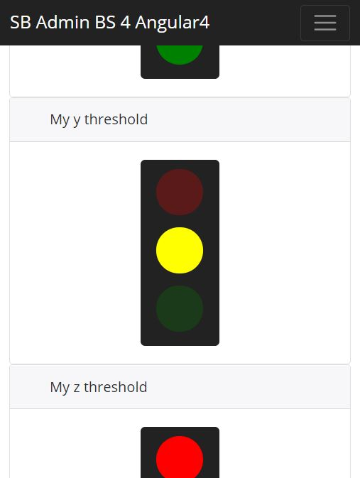

# Angular 4 multi purpose responsive traffic light component

``` js
      ___.            __                         _____             .__ 
      \_ |__ ___.__._/  |_  ____   ___________ _/ ____\____ _______|__|
      | __ <   |  |\   __\/ __ \ /  ___/\__  \\   __\\__  \\_  __ \  |
      | \_\ \___  | |  | \  ___/ \___ \  / __ \|  |   / __ \|  | \/  |
      |___  / ____| |__|  \___  >____  >(____  /__|  (____  /__|  |__|
          \/\/                \/     \/      \/           \/          

```


Multi purpose responsive traffic light control

Constructor
``` js
this.trafficLightState = TrafficLightState.undefined;
      this.trafficLightState$ = Observable.interval(2000)
          .map(i => Math.floor(Math.random() * 4));
```
ngOnInit
``` js
this.trafficLightState$.subscribe(state => this.trafficLightState = state);
```

[Credits for traffic light css](https://codepen.io/samarkandiy/pen/JxnCF)

[Example use in SB Admin](https://github.com/start-angular/SB-Admin-BS4-Angular-4) 



